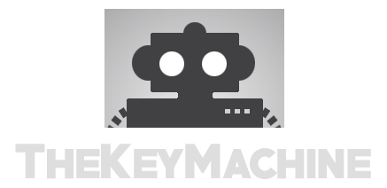

# TheKeyMachine -Animation tool for Maya Animators

TheKeyMachine (TKM) is a toolset specially designed for 3D animators working with Autodesk Maya.

TheKeyMachine offers advanced animation tools that significantly speed up daily tasks and workflows for animators.

It currently works with Maya versions 2022, 2023, and 2024 on Windows, Linux, and macOS.

TKM is in the beta phase and is being developed by Rodrigo Torres (rodritorres.com)
