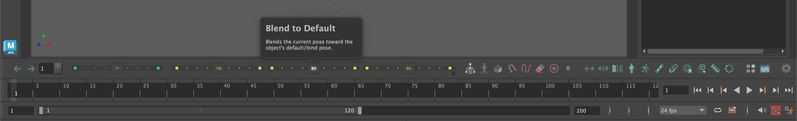
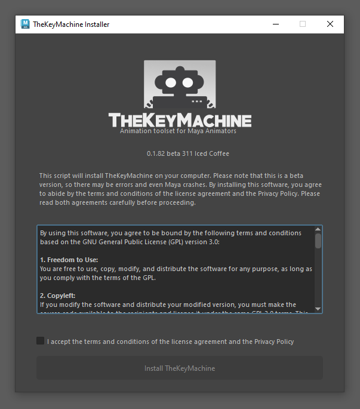

# TheKeyMachine

TheKeyMachine (TKM) is an open source Maya animation toolset built for faster key editing, cleaner selection workflows, smarter copy/paste utilities, floating tools, and timeline-aware operations.

It is designed for 3D animators working in Autodesk Maya and currently supports Maya 2022, 2023, 2024, and 2025 on Windows, Linux, and macOS.

TKM is developed by <b>Rodrigo Torres</b> (<a href="https://www.rodritorres.com">rodritorres.com</a>).

This version is modified by <b>Alehaaaa</b> (<a href="https://alehaaaa.github.io">alehaaaa.github.io</a>), currently working at <b>Framestore</b>.

<a href="https://www.thekeymachine.xyz">thekeymachine.xyz</a>

## Main Tool Areas

### Key Editing

- `Nudge Left / Nudge Right` to move selected keys in time, including insert/remove inbetween variants
- `Share Keys` to unify keyed times across selected objects
- `reBlock` to rebuild selected animation onto a shared stepped timing structure
- `Bake on Ones / Twos / Threes / Fours / Custom` for fixed or custom sampling
- `Clear Selection` to remove key selection quickly
- `Select Scene Anim` to collect animation curves from the scene

### Selection And Scene Tools

- `Select Rig Controls`, including animated-controls-only variants
- `Isolate` with bookmark support and down-one-level options
- `Create Locator` tools for quick temporary setup work
- `Align` for translation, rotation, scale, full transform, and range matching
- `Tracer` for animation tracing, refresh, visibility, and style switching
- `Reset Values` on the current frame, selected keys, or ranges
- `Delete Anim` in the active time context
- `Selector` for a live selection list window
- `Select Opposite` and `Mirror` for side-based workflows
- `Select Hierarchy` for deeper rig selection

### Copy / Paste

- `Copy Pose / Paste Pose` for current-frame value transfer
- `Copy Animation / Paste Animation` between matching controls
- `Paste Insert` to place copied animation at the current time
- `Paste Opposite` for mirrored transfers
- `Paste To` for chosen target sets

### Offset And Pivot

- `Animation Offset` to protect the current frame while offsetting the surrounding range
- `Temp Pivot` to create or reuse a temporary manipulation pivot
- `Micro Move` for precise transform stepping

### Linking And Space

- `Link Objects` for relative links and optional auto-link behavior
- `World Space` copy/paste for single-frame and range-based motion
- `Attribute Switcher` for enum and attribute-driven switching workflows

### Floating Windows

- `Selection Sets`
- `Orbit`
- `Graph Editor Toolbar`
- `Custom Tools`
- `Custom Scripts`
- `iBookmarks`

## Timeline Feedback

Many tools tint the Maya time slider while they run. Full-range tools tint the full slider holder, while range-based tools tint only the working range, making it easier to see the current operation at a glance.

## Selection Sets

Selection Sets support:

- quick creation from the current selection
- duplicate-content detection
- inline rename
- multiple color families
- scene import/export and quick-file import/export
- floating window and toolbar integration

## Integrated Tool Modules

Dedicated modules live under `TheKeyMachine/tools/` for:

- `animation_offset`
- `attribute_switcher`
- `graph_toolbar`
- `ibookmarks`
- `micro_move`
- `orbit`
- `selection_sets`

This keeps major tool logic separated from the main toolbar assembly.

## Version

Current version: `0.1.82`

