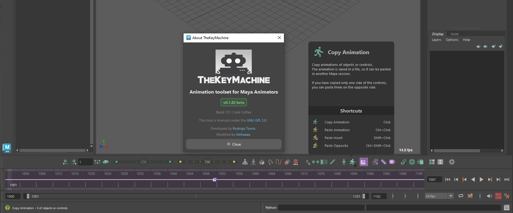
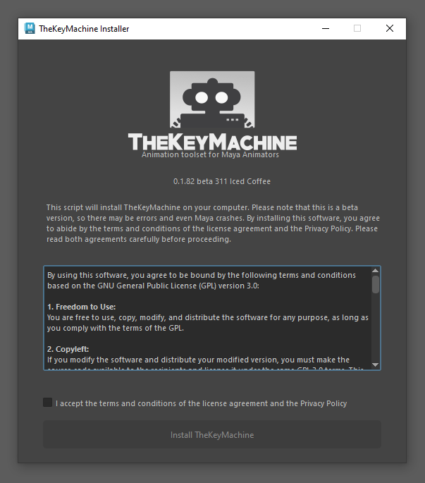

  

# TheKeyMachine, animation toolbar

Maintained by <b>Alehaaaa</b> at <a href="https://alehaaaa.github.io">alehaaaa.github.io</a>. Originally developed by <b>Rodrigo Torres</b> at <a href="https://www.rodritorres.com">rodritorres.com</a>.

This is an independent fork. Issues and support apply only to this version.

TheKeyMachine (TKM) is an open-source animation toolset for Autodesk Maya, designed to speed up keyframe editing, improve selection workflows, simplify copy-and-paste operations, provide floating tools, and support timeline-aware animation tasks.

Supports Maya 2022+ on Windows, Linux, and macOS.

<a href="https://www.thekeymachine.xyz">thekeymachine.xyz</a>

## Main Tool Areas

### Key Editing

- `Nudge Left / Nudge Right` to move selected keys in time, including insert/remove inbetween variants
- `Share Keys` to unify keyed times across selected objects
- `reBlock` to rebuild selected animation onto a shared stepped timing structure
- `Bake on Ones / Twos / Threes / Fours / Custom` for fixed or custom sampling
- `Clear Selection` to remove key selection quickly
- `Select Scene Anim` to collect animation curves from the scene
- `Anim Curve Tools` for selection-aware clear/copy/cut/paste/crop/reverse/filter workflows
- `Set Smart Key` for animated curves, selected channels, Graph Editor keys, highlighted ranges, exact subframes, and unanimated objects in mixed selections
- `Smart Euler Filter`, redundant-key removal, and static-curve cleanup that respect the active selection context
- `Snap Keys` works from object or key/range selection and merges multiple subframe keys into the closest whole-frame key
- nudge, inbetween, bake, tangent, and background-runner actions use clearer toolbar icons

### Tangents

- tangent buttons support modifier-click variants for Maya default tangent and all-keys operations
- stepped tangent menus focus on stepped-safe actions
- slider mode menus stay connected to visible modes, including torn-off menus and live pin/default changes

### Selection And Scene Tools

- `Select Rig Controls`, including animated-controls-only variants
- `Isolate` with bookmark support and down-one-level options
- `Create Locator` tools for quick temporary setup work
- `Align` for translation, rotation, scale, full transform, and matching only the reference object's real keys across a selected range
- `Tracer` for animation tracing, refresh, visibility, and style switching
- `Default Values` on the current frame, selected keys, or ranges
- `Clear Animation` in the active time context
- `Selector` for a live selection list window
- `Select Opposite` and `Mirror` for side-based workflows
- `Select Hierarchy` for deeper rig selection

### Copy / Paste

- `Copy Pose / Paste Pose` for current-frame value transfer
- `Copy Animation / Paste Animation` between matching controls
- `Paste Insert` to place copied animation at the current time
- `Paste Opposite` for mirrored transfers
- `Paste To` for chosen target sets

### Offset And Pivot

- `Animation Offset` to protect the current frame while offsetting the surrounding range
- `Temp Pivot` to create or reuse a temporary manipulation pivot
- `Micro Move` for live, object-oriented precision translation and rotation with cursor acceleration
- `Depth Mover` to push selected controls toward or away from the camera with drag-adjusted sensitivity

### Linking And Space

- `Link Objects` for relative links and optional auto-link behavior
- `World Space` samples every frame in the selected or visible playback range, supports one-to-many pastes, and preserves animation outside the pasted range
- `Attribute Switcher` for enum and attribute-driven switching, drag-release popup choices, and compact scrolling that expands only when the screen-limited content requires it

### Animation Recovery

`Animation Recovery` is an optional background runner that keeps lightweight, scene-specific checkpoints when animation, transform channels, enum controls, or hierarchy changes are detected. It also creates a distinct checkpoint whenever the Maya scene is saved.

The recovery window lists the newest changes first with their source scene, date, reason, current frame, playback and animation ranges, and selection count. Recover with nothing selected to restore all captured animation and channel values, or select controls first to restore only those controls and their animation. Recovery runs through the standard cancellable operation system with automatic ETA feedback and does not create another checkpoint when a saved point is applied.

Most checkpoints store only their changed data. Periodic complete baselines bound replay time, while parent-linked checkpoints detect missing history instead of silently producing an incomplete result. The newest 20 complete baseline generations are retained per scene, keeping history bounded without orphaning deltas. When a point is recovered, the shortest complete chain is merged to rebuild the requested animation state. Each scene keeps a persistent recovery identity across Save, Save As, and incremental saves, with compact recovery files stored separately under `TheKeyMachine_user_data/animation_recovery/`.

When a scene is opened with the same recovery identity but an older saved-file time than its newest checkpoint, the recovery window opens automatically so the newer animation can be reviewed or restored.

### Floating Windows

- `Selection Sets`
- `Orbit`
- `Search`
- `Graph Editor Toolbar`
- `Isolate Bookmarks`

## Timeline Feedback

Many tools tint the Maya time slider while they run. Full-range tools tint the full slider holder, while range-based tools tint only the working range. Tints inherit the owning toolbar section color, keeping related operations visually consistent.

## Tooltips And Menus

Tooltips use the active tool labels and icons, including torn-off menus and shelf buttons. Menu actions keep their full rich tooltip content while hovering, so videos, media, and multi-line help remain available from menu-driven tools.

The `Custom Tools` menu loads manifest-defined commands, folders, Maya resource icons, toolbar pins, hotkeys, and shelf buttons.

## Selection Sets

Selection Sets support:

- quick creation from the current selection
- duplicate-content detection
- inline rename
- multiple color families
- scene import/export and quick-file import/export
- floating window and toolbar integration

## Integrated Tool Modules

Dedicated tools live under `TheKeyMachine/tools/` for:

- `animation_recovery`
- `animation_offset`
- `attribute_switcher`
- `depth_mover`
- `gimbal_fixer`
- `graph_toolbar`
- `isolate_bookmarks`
- `micro_move`
- `orbit`
- `search`
- `selection_sets`

