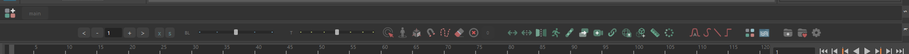

# TheKeyMachine - Animation tool for Maya Animators

TheKeyMachine (TKM) is a open source toolset specially designed for 3D animators working with Autodesk Maya.

TheKeyMachine offers advanced animation tools that significantly speed up daily tasks and workflows for animators.

It currently works with Maya versions 2022, 2023, and 2024 on Windows, Linux, and macOS.

Some of the available features include:

-Simple and fast installer
-Advanced tools like Isolate, Snap, Reset, Counter, Temp Pivot, FollowCam, Anim Offset, Copy and Paste Animation, Copy and Paste World Position, advanced curve editor, customizable menus, and more
-Selection Manager (Selection Sets)
-Advanced sliders for Tween and Blend
And many others

TKM is in the beta phase and is being developed by <b>Rodrigo Torres</b> (rodritorres.com).  

